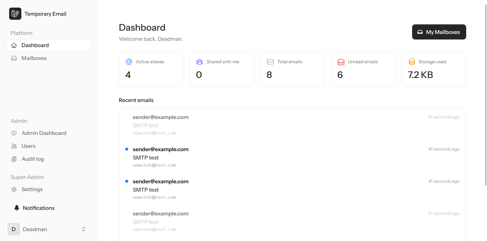
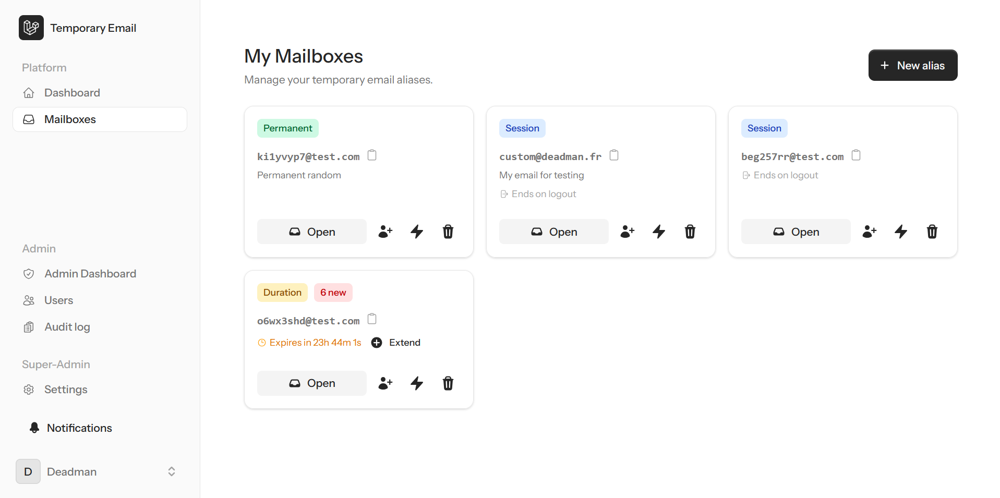
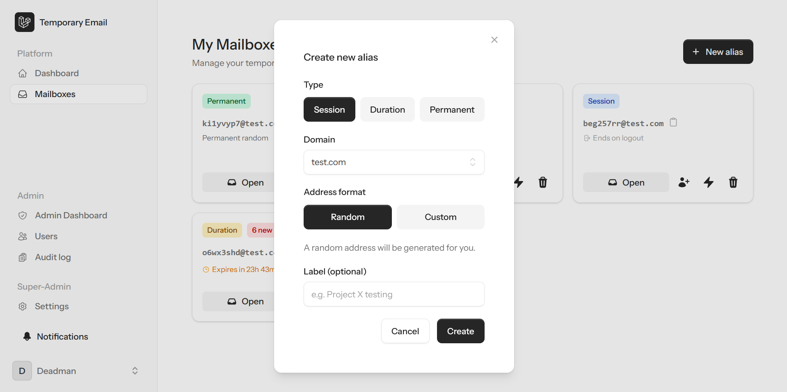
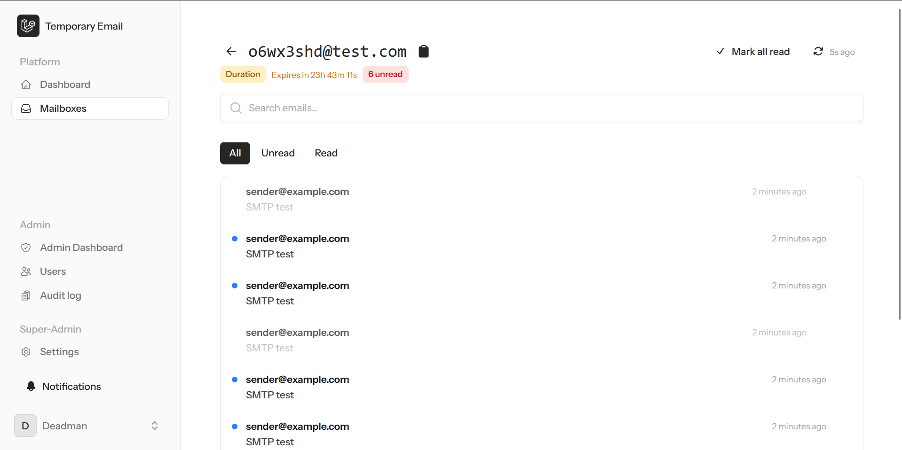
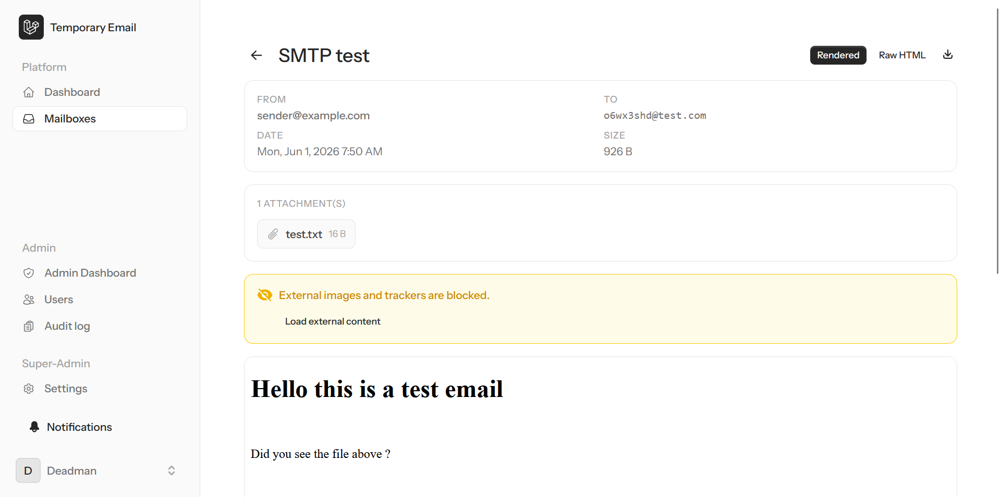
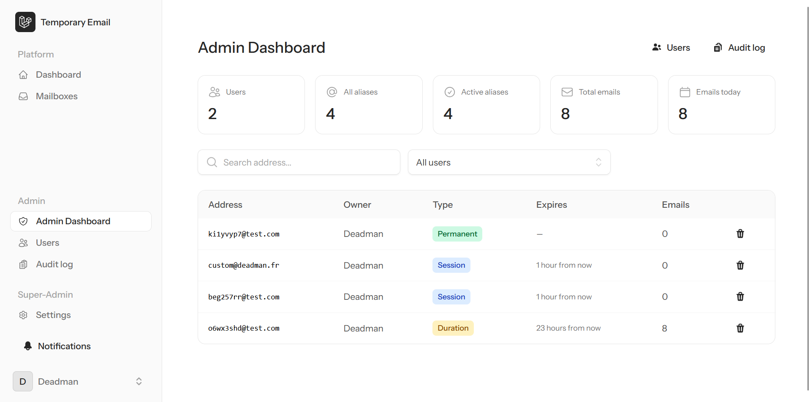
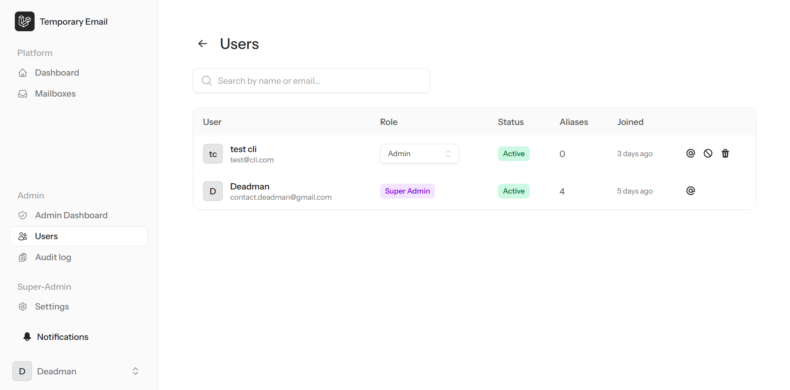
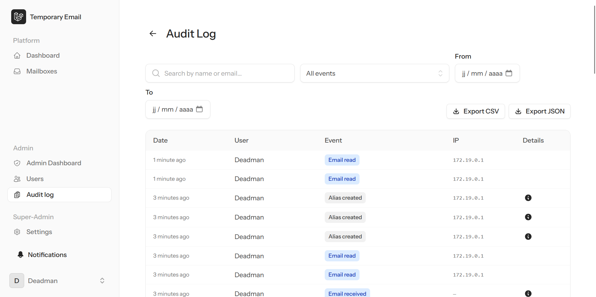
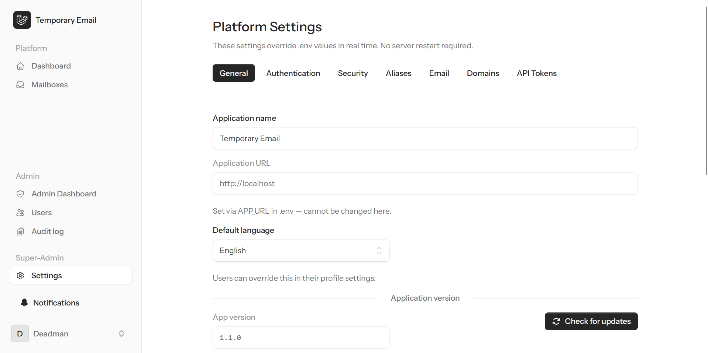

# EmailAlias

Self-hosted temporary email alias platform. Point a domain at it, plug in your SSO, ship it.

No external services. No subscriptions. Your infrastructure, your data.

---

## Stack

| Layer | Technology |
|---|---|
| Backend | PHP 8.4 · Laravel 12 · Fortify |
| Frontend | Livewire 4 · Flux UI 2 · Tailwind CSS 4 |
| Real-time | Laravel Reverb (WebSocket) |
| Database | PostgreSQL 16 |
| Object storage | MinIO (S3-compatible) |
| SMTP receiver | Node.js 22 |
| Reverse proxy | Nginx |
| Runtime | Docker Compose |

---

## How it works

```
Internet
    │
    ├── port 25   →  smtp-server (Node.js)  →  POST /internal/inbound
    │                                                      │
    └── port 80   →  nginx  →  app (Laravel/PHP-FPM)  ◄───┘
                                     │
                              PostgreSQL · MinIO
                                     │
                              Reverb (WebSocket) → browser
```

1. Email arrives → SMTP server accepts it for configured domains
2. Parsed payload is POSTed to Laravel over the internal Docker network (shared secret)
3. `ProcessInboundEmail` job finds the alias, stores the email, broadcasts `EmailReceived`
4. Browser receives the event and updates the inbox in real time

---

## Features

- **Aliases** — session, duration (1h–30d), or permanent; random or custom address
- **Inbox** — real-time via WebSocket; HTML rendered in sandboxed iframe; attachment download
- **Domains** — multi-domain support; managed in UI (Settings → Domains)
- **Auth** — email/password · Azure AD · Keycloak/OIDC · SAML 2.0 · TOTP 2FA
- **Roles** — `user` · `admin` · `super_admin`
- **Admin** — audit log, user management, full platform config via UI (no restart required)
- **API** — REST v1 with Sanctum tokens + app-level tokens for machine access

---

## Quick start

```bash
git clone <repo> email-alias && cd email-alias
cp .env.example .env                              # edit at minimum: DB_PASSWORD, SMTP_INTERNAL_SECRET
docker compose up -d
docker compose exec app php artisan key:generate
docker compose exec app php artisan migrate
docker compose exec app php artisan admin:create --super-admin
```

Then log in at `http://<APP_URL>` and go to **Admin → Settings** to configure domains, SSO, limits, etc.

> **HTTPS** is not handled by the stack. Put a TLS-terminating reverse proxy (Caddy, Traefik, Nginx + Certbot…) in front on port 443, or use a load balancer.

---

## Development

No PHP, Node, or Composer needed locally — everything runs inside containers.

```bash
git clone <repo-url> email-alias && cd email-alias
cp .env.example .env          # set APP_URL=http://localhost:8000, DB_PASSWORD=localpassword, SMTP_INTERNAL_SECRET=changeme

docker compose up -d
docker compose exec app php artisan key:generate
docker compose exec app php artisan migrate --seed   # includes demo data
```

| Service | URL |
|---|---|
| App | http://localhost:8000 |
| PostgreSQL | localhost:5432 |
| Reverb | localhost:8080 |
| SMTP receiver | localhost:2525 |

Demo accounts (seeded by `DemoSeeder`):

| Email | Password | Role |
|---|---|---|
| admin@example.com | password | Super Admin |
| dev@example.com | password | User |

### Common commands

```bash
# Artisan
docker compose exec app php artisan migrate
docker compose exec app php artisan migrate:fresh --seed
docker compose exec app php artisan tinker

# Tests (Pest)
docker compose run --rm test
docker compose run --rm test --filter=AliasService
docker compose run --rm test --stop-on-failure

# With coverage (HTML report in laravel/coverage/)
docker compose run --rm test vendor/bin/pest --coverage-html coverage/

# Code style (Pint)
docker compose exec app vendor/bin/pint --dirty

# Assets
docker compose exec app npm run dev     # watch mode
docker compose exec app npm run build   # one-time

# Logs
docker compose logs -f app
docker compose logs -f smtp-server
```

### Testing email ingestion

**Option A — POST directly to the internal endpoint (fastest)**

Create an alias in the UI first, then:

```bash
curl -X POST http://localhost:8000/internal/inbound \
  -H "Content-Type: application/json" \
  -H "X-SMTP-Secret: changeme" \
  -d '{
    "to": ["xk3f9a2b@dev.local"],
    "from_address": "sender@example.com",
    "from_name": "Test Sender",
    "subject": "Hello, this is a test",
    "body_html": "<h1>Hello</h1>",
    "body_text": "Hello",
    "headers": {},
    "size_bytes": 100
  }'
```

**Option B — full SMTP end-to-end**

```bash
swaks --to alias@domain.com \
      --from sender@example.com \
      --server localhost --port 2525 \
      --header "Subject: SMTP test"
```

> Port 2525 is non-privileged; the SMTP container maps it from port 25 internally.

### API

The REST API is at `/api/v1`, authenticated with Sanctum Bearer tokens. Swagger UI is at `/api/docs`.

```bash
docker compose exec app php artisan tinker
>>> $user = \App\Models\User::first();
>>> echo $user->createToken('dev', ['*'])->plainTextToken;
```

App-level tokens (machine-to-machine): **Admin → Settings → API Tokens**.

### Project structure

```
email-alias/
├── docker-compose.yml
├── .env.example
├── nginx/
├── smtp-server/
│   └── src/index.js            # SMTP receiver → POST /internal/inbound
└── laravel/
    ├── app/
    │   ├── Http/Controllers/
    │   │   ├── Api/V1/         # REST endpoints
    │   │   ├── Auth/           # SSO (OAuth2, SAML)
    │   │   └── Internal/       # InboundEmailController
    │   ├── Jobs/               # ProcessInboundEmail, CleanupExpiredAliases, DeliverWebhook
    │   ├── Livewire/
    │   │   ├── Mailbox/        # Dashboard, Inbox, ViewEmail
    │   │   ├── Admin/          # Dashboard, Users, AuditLogViewer, Settings
    │   │   └── Settings/       # Profile, Security, Appearance, ApiTokens
    │   ├── Models/
    │   └── Services/           # AliasService, AuditLogger, SettingService, HtmlSanitizer
    ├── config/emailalias.php
    ├── database/migrations/
    └── routes/
        ├── web.php
        ├── api.php
        ├── internal.php        # SMTP webhook (internal network only)
        └── settings.php
```

---

## Docs

| File | Content |
|---|---|
| [README_DEPLOY.md](README_DEPLOY.md) | Production deployment (env, DNS, launch, scaling) |
| [README_SECURITY.md](README_SECURITY.md) | Security model: roles, encryption, audit |
| [TODO.md](TODO.md) | Feature checklist and known remaining work |

---

## Application screenshots

All the screenshots are taken from the same account, but the sidebar only display what could be done to the user.  
So a basic user won't see the admin options.

<details>
<summary>User view</summary>







</details>

<details>
<summary>Admin view</summary>





</details>

<details>
<summary>Super-admin view</summary>



</details>

---

## Troubleshooting

### How do I create the first admin account?
```bash
docker compose exec app php artisan admin:create --super-admin
```
Omit `--super-admin` for a regular admin. Super Admins have access to Settings and can manage domains, app tokens, and platform configuration.

### How to promote a user or an administrator to the Super Admin role?
You must use the CLI command for this and use it like you were creating a new user. Specify the user email to promote.
```bash
docker compose exec app php artisan admin:create --super-admin
```

#### How to demote a Super Admin?
You must use the CLI command for this and use it like you were creating a new user. Specify the user email to promote and choose "Yes" when asked to downgrade to Admin.
```bash
docker compose exec app php artisan admin:create
```

### How do I set up the platform after install?
Log in as Super Admin → **Admin → Settings**. From there you can:
- **Domains** tab — add at least one domain (must match your MX record)
- **Authentication** tab — configure SSO (Azure AD / Keycloak / SAML), enable/disable local login
- **General** tab — set app name, logo, health check visibility
- **Aliases / Email** tabs — configure quotas, retention, size limits

### No domains configured — SMTP is rejecting all mail
The SMTP receiver has no open-relay fallback. Add a domain in **Settings → Domains**, then wait up to 5 minutes for the SMTP server to refresh (or restart the `smtp-server` container).

### Email not showing up in real time
Check that Reverb is running (`docker compose ps`) and that `BROADCAST_CONNECTION=reverb` is set in `.env`. If assets were built before the env vars were set, rebuild: `docker compose exec app npm run build`.

### `403` on `/internal/inbound`
The `X-SMTP-Secret` header doesn't match `SMTP_INTERNAL_SECRET`. Both the `app` and `smtp-server` containers must use the same value.

### How do I reset a user's password?
```bash
docker compose exec app php artisan tinker
>>> \App\Models\User::where('email', 'user@example.com')->first()->update(['password' => bcrypt('newpassword')]);
```

### How do I create an app-level API token (for the SMTP receiver or CI)?
Log in as Super Admin → **Admin → Settings → API Tokens**. Set a name and abilities (e.g. `read:domains`). The plain token is shown once — copy it immediately.

### Migrations fail on upgrade
Always run with `--force` in production:
```bash
docker compose exec app php artisan migrate --force
```
